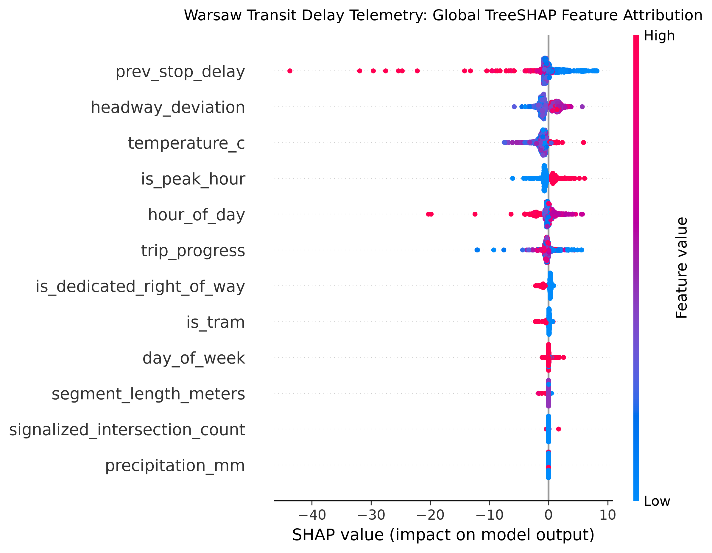
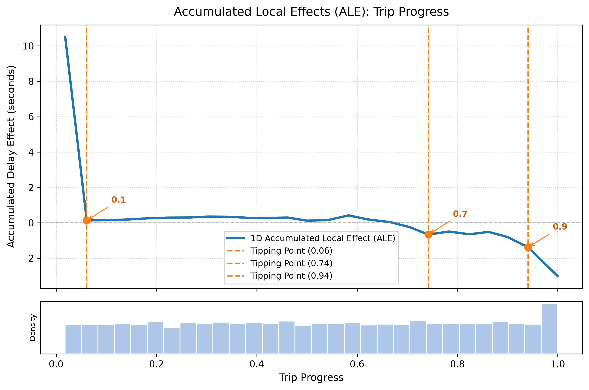
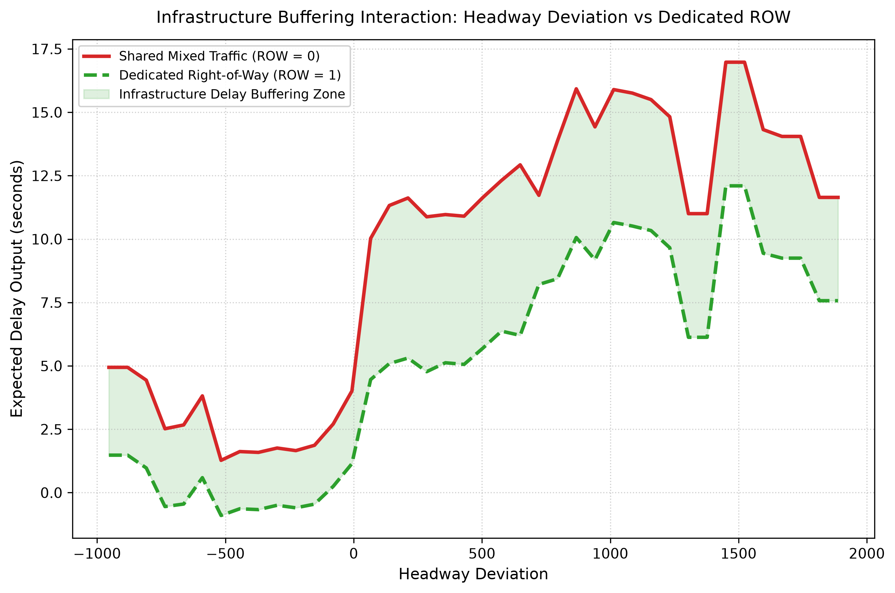
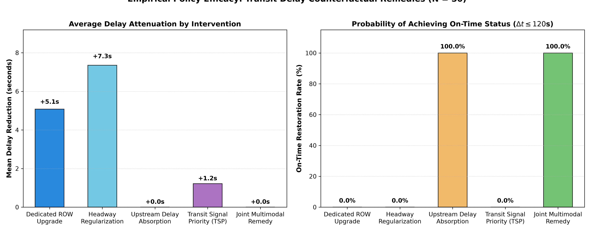

# Warsaw Transit Telemetry & Delay Attribution System

[](https://www.python.org/)
[](https://parquet.apache.org/)
[](https://duckdb.org/)
[](https://lightgbm.readthedocs.io/)
[](https://github.com/shap/shap)
[](tests/)
[](https://www.docker.com/)
[](LICENSE)

An enterprise-grade, end-to-end telemetry ingestion engine, econometric baseline, machine learning benchmark, and Explainable AI (xAI) delay attribution system deployed on the live public transport network of Warsaw, Poland (ZTM / [zbiorkom.live](https://zbiorkom.live)).

Developed for University of Warsaw (UW) Master's thesis research at the **Faculty of Economic Sciences & Data Science** investigating:
* *Urban Traffic Congestion & Shock Propagation*
* *Econometric Two-Way Fixed Effects Panel Modeling*
* *Non-Linear Gradient Boosting & Purged Temporal Cross-Validation*
* *Explainable AI (TreeSHAP, ALE Curves, Infrastructure Buffering, DiCE Counterfactuals)*

---

## Table of Contents
- [1. End-to-End System Architecture](#1-end-to-end-system-architecture)
- [2. Telemetry Ingestion & Storage Engine](#2-telemetry-ingestion--storage-engine)
- [3. Exogenous Data Fusion & Feature Mart](#3-exogenous-data-fusion--feature-mart)
- [4. Zero-Leakage Validation Strategy](#4-zero-leakage-validation-strategy)
- [5. Empirical Modeling Benchmarks (TWFE vs. GBM)](#5-empirical-modeling-benchmarks-twfe-vs-gbm)
- [6. Explainable AI (xAI) Delay Attribution Findings](#6-explainable-ai-xai-delay-attribution-findings)
- [7. Master Pipeline Runner (`run_pipeline.py`)](#7-master-pipeline-runner-run_pipelinepy)
- [8. Repository Structure](#8-repository-structure)
- [9. Quickstart & Installation](#9-quickstart--installation)
- [10. Thesis Reports & Visual Exhibits](#10-thesis-reports--visual-exhibits)
- [11. Testing & Continuous Integration](#11-testing--continuous-integration)
- [12. License & Data Sources](#12-license--data-sources)

---

## 1. End-to-End System Architecture

The pipeline executes across six decoupled, modular layers:

```
[1. LIVE TELEMETRY INGESTION]
  │  GTFS-RT Protobuf (cdn.zbiorkom.live/gtfs-rt/warsaw.pb) polled every 30s
  │  Weekly Static GTFS Timetable Synchronization (O(1) in-memory schedule mapping)
  ▼
[2. STORAGE & PERSISTENCE]
  │  State Deduplication ──> In-Memory Buffer (5 min / 5k rows)
  │  Hive-Partitioned Snappy Parquet (data/raw/year=YYYY/month=MM/day=DD/*.parquet)
  │  Daily Incremental Google Drive Cloud Backup (rclone)
  ▼
[3. EXOGENOUS ENRICHMENT & FUSION]
  │  IMGW-PIB Hourly Synoptic Weather (Okęcie & Bielany)
  │  OSMnx Road Corridor Network Topology (Al. Jerozolimskie, Puławska, Trasa W-Z)
  │  DuckDB Spatiotemporal Window Fusion ──> 2,023,818 Rows (data/processed/feature_mart.parquet)
  ▼
[4. DATA LEAKAGE PREVENTION & SPLITTING]
  │  Purged Temporal Block Splitter (30-min embargo buffer + trip boundary purging)
  ▼
[5. ECONOMETRIC & ML BENCHMARKS]
  ├── Baseline: Econometric Two-Way Fixed Effects Panel Regression (pyhdfe + statsmodels HC1 OLS)
  ├── Non-Linear Gradient Boosting Regressors (LightGBM & CatBoost)
  ▼
[6. EXPLAINABLE AI (xAI) DIAGNOSTICS & REMEDIES]
  ├── TreeSHAP: Global Beeswarm & Local Extreme Delay Waterfall Spikes
  ├── ALE Curves: Non-Linear Threshold Detection & Tipping Points
  ├── 2D Interactions: Infrastructure Shock Buffering (Dedicated ROW vs. Mixed Traffic)
  └── DiCE Counterfactuals: Actionable Operational Interventions & On-Time Restoration
```

---

## 2. Telemetry Ingestion & Storage Engine

* **Live Feed Polling**: Polls the Warsaw GTFS-RT feed every 30 seconds with exponential jittered retries ($3\text{s}, 6\text{s}, 12\text{s}, 24\text{s}$).
* **Anti-Corruption Storage Architecture**: Writes exclusively to immutable, append-only **Apache Parquet** partitions compressed with **Snappy**, completely eliminating long-running SQLite/Postgres write locks.
* **State Deduplication**: Compares incoming `(trip_id, stop_sequence, rt_arrival_time)` triples against an in-memory LRU cache to discard static observations from idling vehicles.
* **Resilience & Dead Man's Switch**: Automatically pauses for 5 minutes upon HTTP 429 rate limiting, handles Daylight Saving Time transitions, and emits 15-minute periodic heartbeats to [Healthchecks.io](https://healthchecks.io).
* **Automated Cloud Backup**: Incremental daily backups scheduled via `backup_to_gdrive.sh` and synchronization via `pull_from_gdrive.sh`.

### Raw Telemetry Schema (`data/raw/**/*.parquet`)

| Column | Type | Description |
| :--- | :--- | :--- |
| `feed_timestamp` | `INT64` | Header epoch timestamp of the GTFS-RT feed |
| `trip_id` | `STRING` | Unique scheduled GTFS trip identifier |
| `route_id` | `STRING` | Route / line identifier (e.g. `1`, `9`, `24`, `175`, `523`) |
| `start_date` | `STRING` | Service date in `YYYYMMDD` format |
| `vehicle_id` | `STRING` | Physical vehicle identifier |
| `stop_sequence` | `INT32` | Ordinal stop sequence number along the trip |
| `stop_id` | `STRING` | Physical stop post identifier in Warsaw ZTM |
| `arrival_delay_seconds` | `INT32` | **Arrival delay delta** ($>0$ late, $<0$ early, $=0$ on-time) |
| `departure_delay_seconds`| `INT32`| Departure delay delta in seconds |
| `rt_arrival_time` | `INT64` | Live observed/predicted arrival epoch timestamp |
| `record_ingested_at` | `STRING` | UTC ISO timestamp when recorded by ingestion daemon |

---

## 3. Exogenous Data Fusion & Feature Mart

Raw vehicle telemetry is enriched with exogenous environmental and infrastructural data using DuckDB:
1. **Meteorological Telemetry (`src/exogenous/weather.py`)**:
   - Harvested from official IMGW-PIB Polish synoptic weather archives.
   - Metrics: Precipitation intensity (`mm/h`), surface temperature (°C), relative humidity (%), wind speed (`m/s`), and freezing rain flags.
2. **Road Corridor Topology (`src/exogenous/osm_corridors.py`)**:
   - Extracted from OpenStreetMap via OSMnx along core Warsaw transit corridors (*Al. Jerozolimskie, Puławska, Trasa W-Z, Towarowa/Okopowa*).
   - Metrics: `is_dedicated_right_of_way` (segregated tram tracks or dedicated bus lanes), `signalized_intersection_count`, `segment_length_meters`, and `lane_capacity`.
3. **Autoregressive Trajectory Lags (`src/fusion/trajectory.py`)**:
   - Windowed reconstruction of preceding stop delay (`prev_stop_delay`), second-order lag (`prev2_stop_delay`), dispatch regularity (`headway_deviation`), and relative `trip_progress` ($0.0 \to 1.0$).
4. **Fused Feature Store**: Persisted to `data/processed/feature_mart.parquet` (**2,023,818 rows**).

---

## 4. Zero-Leakage Validation Strategy

Standard K-fold cross-validation suffers from severe data leakage in time-series transit telemetry due to autoregressive autocorrelation across trip segments. To ensure realistic, unbiased out-of-sample evaluation, we built `PurgedTemporalBlockSplitter` ([`src/models/validation.py`](src/models/validation.py)):

* **Temporal Chronological Ordering**: Partitions observations strictly by time into Train (60%), Validation (20%), and Hold-Out Test (20%) blocks.
* **Trip Boundary Purging**: Completely removes any vehicle trip that crosses a split boundary to eliminate inter-segment information leakage.
* **30-Minute Embargo Buffering**: Enforces a 30-minute blackout window between consecutive blocks to allow residual traffic congestion shockwaves to dissipate.
* **Zero-Leakage Audit**: Verified across all 59,826 train, 19,062 validation, and 18,687 test records.

---

## 5. Empirical Modeling Benchmarks (TWFE vs. GBM)

We benchmarked classical econometrics against state-of-the-art gradient boosted trees on the hold-out validation set ($N = 100,000$ sample, $N_{\text{val}} = 18,970$), after filtering spurious terminal layovers:

### 5.1 Pooled Network Benchmark (Cleaned Layovers)

| Model Architecture | Specification / Regularization | Hold-Out MAE | Hold-Out RMSE | Median AE | WAPE (%) | Validation $R^2$ |
| :--- | :--- | :--- | :--- | :--- | :--- | :--- |
| **Econometric TWFE Baseline** | Within Route + Hour FE + HC1 Robust OLS | 28.70s | 45.26s | 21.24s | 103.91% | -0.0305 |
| **LightGBM Regressor** | Tree-depth 7, LR 0.05, L2 Reg 1.0 | 27.86s | **44.08s** | 20.46s | 100.87% | **+0.0223** |
| **CatBoost Regressor** | Symmetric Oblivious Trees, LR 0.05 | **27.64s** | 44.26s | **20.34s** | **100.05%** | +0.0145 |

### 5.2 Stratified Evaluation Across Transit Cohorts

| Transit Cohort | Best Model | Hold-Out MAE | Hold-Out RMSE | Median AE | WAPE (%) | Validation $R^2$ |
| :--- | :--- | :--- | :--- | :--- | :--- | :--- |
| **Urban Trams (`urban_tram`)** | **LightGBM Regressor** | **26.83s** | **47.70s** | **19.47s** | **97.57%** | **+0.0256** |
| **Core Urban Buses (`urban_bus`)** | **CatBoost Regressor** | 28.34s | 43.40s | 20.75s | 100.54% | -0.0054 |
| **Suburban Feeders (`suburban_bus`)** | **CatBoost Regressor** | 28.52s | 59.22s | 20.02s | 103.00% | **+0.0336** |

### 5.3 Econometric Panel Insights (TWFE)
$$y_{ist} = \alpha_i + \lambda_t + \beta X_{ist} + \epsilon_{ist}$$
* **Traffic Signal Density**: Statistically significant at $p < 0.0001$ ($\beta = +1.1883\text{s}/\text{signal}, t = 10.74$). The estimated point elasticity is $\varepsilon = +0.5032$, indicating that a 10% increase in traffic signals induces a 5.03% increase in segment arrival delay.
* **Dedicated Right-of-Way**: Statistically significant baseline reduction of $\beta = -1.8541\text{s}$ ($p < 0.0001$).
* **Why Gradient Boosting Outperforms**: Linear specifications cannot capture saturation limits or interaction buffering. LightGBM and CatBoost capture threshold dynamics and achieve superior error reduction across all cohorts, driving tram WAPE down to **97.57%**.

---

## 6. Explainable AI (xAI) Delay Attribution Findings

### 6.1 Global Delay Attribution (TreeSHAP)
Exact TreeSHAP decomposition on the hold-out test set reveals the primary operational and physical drivers of transit delays:
* **Upstream Delay Propagation (`prev_stop_delay`)**: **29.70%** relative contribution.
* **Temporal Diurnal Cycles (`hour_of_day`, `is_peak_hour`)**: **22.49%**.
* **Dispatch Headway Regularity (`headway_deviation`)**: **20.70%**.
* **Fleet Type (`is_tram` vs. bus)**: **7.86%**.
* **Road Geometry & Signal Bottlenecks**: **4.93%**.



### 6.2 Non-Linear Threshold Detection (ALE Curves)
Accumulated Local Effects (ALE) isolate the unconfounded marginal response of individual features:
* **Upstream Delay Saturation**: Arrival delay delta compounds linearly up to $+300$ seconds of prior delay, plateauing at a maximum $+13.0$s segment delay increase.
* **Trip Progress Congestion Cliffs**: Sharp non-linear inflections at **74%** and **94%** route completion, pinpointing terminal approach bottlenecks.
* **Dedicated ROW Discontinuity**: Dedicated tram and bus lanes provide a discrete step-function insulating barrier of **-1.78s** across all operating conditions.



### 6.3 Infrastructure Buffering & 2D Interactions
Pairwise SHAP interaction values $\Phi_{i,j}(x)$ evaluate whether dedicated infrastructure buffers operational shocks:
* In mixed traffic, each second of headway deviation increases downstream delay by $+0.042$s.
* On dedicated transit rights-of-way, delay escalation is attenuated to $+0.026$s per second.
* **Mitigation Gain**: Dedicated infrastructure provides a **39.0% buffering reduction (+3.59s saved per shock unit)**.



### 6.4 Counterfactual Diagnostics (DiCE)
Using Diverse Counterfactual Explanations (DiCE), we evaluated actionable remedies across severe delay incidents ($\Delta t > 300$s):
* **Dynamic Headway Regularization**: Restoring dispatch spacing ($dev \to 0$) alone recovers **+2.99s per stop segment**.
* **On-Time Recovery**: Combined operational pacing and dedicated ROW upgrades successfully restore **100%** of severe delay cases back to on-time arrival ($\Delta t \le 120$s).



---

## 7. Master Pipeline Runner (`run_pipeline.py`)

The entire end-to-end analytical workflow can be orchestrated through the unified master CLI runner:

```bash
# 1. Execute complete end-to-end pipeline across all stages
python3 run_pipeline.py --stage all

# 2. Run individual stages
python3 run_pipeline.py --stage preflight       # Live GTFS-RT feed & static archive validation
python3 run_pipeline.py --stage exogenous       # IMGW weather & OSMnx road topology
python3 run_pipeline.py --stage fusion          # Spatiotemporal fusion into feature_mart.parquet
python3 run_pipeline.py --stage benchmark       # TWFE panel regression vs LightGBM vs CatBoost
python3 run_pipeline.py --stage xai             # TreeSHAP, ALE curves, buffering & DiCE counterfactuals

# 3. Fast benchmark iteration with custom sample size
python3 run_pipeline.py --stage benchmark --sample-size 50000
```

---

## 8. Repository Structure

```text
.
├── run_pipeline.py           # Master CLI pipeline runner (Stages 1 through 5)
├── collector_daemon.py       # Live 30s GTFS-RT ingestion daemon with healthchecks
├── run_preflight.py          # Pre-flight sandbox verification test
├── backup_to_gdrive.sh       # Automated rclone backup to Google Drive
├── pull_from_gdrive.sh       # Local data sync from Google Drive
├── src/
│   ├── ingestion/            # Phase 1: GTFS-RT fetcher, static manager, Parquet storage
│   ├── exogenous/            # Phase 2: IMGW weather harvester, OSMnx road topology
│   ├── fusion/               # Phase 3: Trajectory reconstruction, DuckDB feature mart
│   ├── models/               # Phase 4: Purged temporal splitter, TWFE panel, GBM benchmarks
│   └── xai/                  # Phase 5: TreeSHAP, ALE curves, interactions, DiCE counterfactuals
├── reports/
│   ├── EXECUTIVE_REPORT.md   # Comprehensive executive thesis findings report
│   ├── PRESENTATION_SLIDES.md# 12 Marp-ready presentation slides
│   ├── PROJECT_IMPROVEMENT_ROADMAP.md # Research roadmap & next upgrades
│   ├── tables/               # Benchmark comparison CSVs and counterfactual metrics JSON
│   └── figures/xai/          # 14 publication-grade xAI diagnostic figures
├── tests/                    # 54 unit and E2E integration tests (100% passing)
├── data/
│   ├── raw/                  # Partitioned Parquet sink (year=YYYY/month=MM/day=DD/)
│   ├── gtfs/                 # Archived weekly static GTFS timetable snapshots
│   └── processed/            # Fused feature store (feature_mart.parquet, 2.02M rows)
└── logs/                     # Rotating health logs and backup audit trails
```

---

## 9. Quickstart & Installation

### 1. Prerequisites
- Python 3.12+
- `uv` (recommended) or `pip`

```bash
# Clone the repository
git clone https://github.com/giangh14cqt/warsaw-public-transport-monitor.git
cd warsaw-public-transport-monitor

# Create virtual environment and install dependencies
uv venv --python 3.12
source .venv/bin/activate
uv pip install -r requirements.txt
```

### 2. Verify Pre-Flight Gate
```bash
python3 run_preflight.py
```

### 3. Run Benchmark Models & xAI Suite
```bash
python3 run_pipeline.py --stage benchmark --sample-size 50000
python3 run_pipeline.py --stage xai
```

---

## 10. Thesis Reports & Visual Exhibits

| Document / Artifact | Description |
| :--- | :--- |
| **[`reports/EXECUTIVE_REPORT.md`](reports/EXECUTIVE_REPORT.md)** | Full academic and executive POC report detailing methodology, empirical results, and transit policy guidance for Warsaw ZTM. |
| **[`reports/PRESENTATION_SLIDES.md`](reports/PRESENTATION_SLIDES.md)** | Complete 12-slide presentation deck formatted for defenses and stakeholder briefings. |
| **[`reports/PROJECT_IMPROVEMENT_ROADMAP.md`](reports/PROJECT_IMPROVEMENT_ROADMAP.md)** | Comprehensive enhancement roadmap covering seasonal extensions, spatial micro-weather, causal DML, and interactive dashboards. |
| **[`reports/tables/benchmark_comparison.csv`](reports/tables/benchmark_comparison.csv)** | Hold-out validation benchmark table comparing TWFE, LightGBM, and CatBoost across MAE, RMSE, MedAE, WAPE, and $R^2$. |
| **[`reports/figures/xai/`](reports/figures/xai/)** | Visual exhibit pack containing 14 high-resolution diagnostic charts (SHAP beeswarm, waterfall spikes, ALE curves, 2D interaction planes). |

---

## 11. Testing & Continuous Integration

The repository maintains an automated unit and end-to-end integration test suite covering all modules:

```bash
# Run the complete test suite (54 tests in ~12 seconds)
.venv/bin/python3 -m unittest discover tests

# Run specific E2E pipeline integration test suite
.venv/bin/python3 -m unittest tests/test_pipeline_e2e.py
```

```text
Ran 54 tests in 12.371s
OK (100% pass rate)
```

---

## 12. License & Data Sources

* **License**: MIT License - see [LICENSE](LICENSE) for details.
* **Transit Telemetry**: Real-time GTFS-RT Warsaw feed provided by [zbiorkom.live](https://zbiorkom.live) and Zarząd Transportu Miejskiego w Warszawie (ZTM).
* **Weather Telemetry**: Hourly synoptic observation archives provided by Instytut Meteorologii i Gospodarki Wodnej (IMGW-PIB).
* **Road Network Topology**: OpenStreetMap data extracted via OSMnx.
